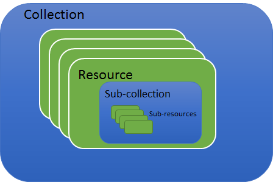
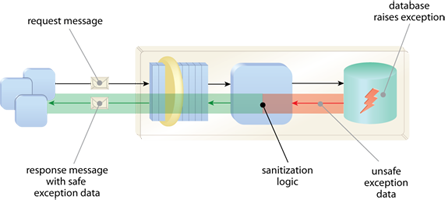

# Digipolis API design & style requirements v4.2.1


## Inhoudstabel
<!-- PC : generated with doctoc (https://www.npmjs.com/package/doctoc) with option --notitle -->

<!-- START doctoc generated TOC please keep comment here to allow auto update -->
<!-- DON'T EDIT THIS SECTION, INSTEAD RE-RUN doctoc TO UPDATE -->


- [Document historiek](#document-historiek)
- [Cheat sheet](#cheat-sheet)
  - [Taal](#taal)
  - [Formaat API documentatie op de API Engine](#formaat-api-documentatie-op-de-api-engine)
  - [Payload](#payload)
  - [Resource](#resource)
  - [Request](#request)
  - [Paginatie](#paginatie)
  - [Error model](#error-model)
  - [Versionering](#versionering)
  - [Langdurende operaties](#langdurende-operaties)
  - [Swagger](#swagger)
  - [HTTP verbs](#http-verbs)
  - [HTTP response codes](#http-response-codes)
- [API's](#apis)
- [API design & style requirements](#api-design--style-requirements)
- [REST introductie](#rest-introductie)
- [Resource representatie](#resource-representatie)
  - [Taal](#taal-1)
  - [JSON conventies](#json-conventies)
  - [Datums en timestamps](#datums-en-timestamps)
  - [Durations](#durations)
  - [Geolocaties](#geolocaties)
  - [Hiërarchie](#hi%C3%ABrarchie)
- [Resources](#resources)
  - [URI structuur](#uri-structuur)
  - [Naming conventions](#naming-conventions)
  - [Media types en content negotiation](#media-types-en-content-negotiation)
- [Request](#request-1)
  - [Request body & query parameters](#request-body--query-parameters)
  - [HTTP verbs](#http-verbs-1)
  - [Voorbeelden](#voorbeelden)
    - [GET](#get)
    - [PUT](#put)
    - [POST](#post)
    - [PATCH](#patch)
    - [DELETE](#delete)
- [Status codes & response](#status-codes--response)
- [Filteren en sorteren](#filteren-en-sorteren)
  - [Filteren op resources](#filteren-op-resources)
    - [Filteren op individuele velden](#filteren-op-individuele-velden)
  - [Filteren op resource representatie](#filteren-op-resource-representatie)
  - [Sorteren](#sorteren)
- [Paginatie](#paginatie-1)
  - [Paginatie query parameters](#paginatie-query-parameters)
  - [Paginatie response bericht](#paginatie-response-bericht)
    - [Een voorbeeld](#een-voorbeeld)
- [Error handling](#error-handling)
  - [Exception shielding](#exception-shielding)
  - [Error model](#error-model-1)
  - [HTTP status codes en error model](#http-status-codes-en-error-model)
- [Versionering](#versionering-1)
  - [Belang van een goede versioneringsstrategie](#belang-van-een-goede-versioneringsstrategie)
  - [Algemene versioneringsstrategie](#algemene-versioneringsstrategie)
  - [API contract versionering](#api-contract-versionering)
  - [API technische versionering](#api-technische-versionering)
    - [Voordelen](#voordelen)
    - [Nadelen](#nadelen)
- [Langdurende operaties](#langdurende-operaties-1)

<!-- END doctoc generated TOC please keep comment here to allow auto update -->


## Document historiek

Versie   | Auteur                 | Datum      | Opmerkingen
------   | -------                | -----      | ------------
1        | Dimitri Van Kerckhoven | 06/06/2016 | Initial draft.
2        | Dimitri Van Kerckhoven | 12/07/2016 | Update REST introductie en uitbreiding JSON conventies met array encapsulation.
3        | Steven Vanden Broeck   | 25/10/2016 | Typo's en correcties.
4        | Peter Claes            | 28/04/2017 | Cheat sheet & verduidelijkingen.
5        | Peter Claes            | 23/11/2017 | HTTP response code 204.
6        | Bart Van Steen         | 28/11/2017 | Aanpassing richtlijn versionering.
7        | Peter Claes            | 01/02/2018 | Markdown versie (Github).


## Cheat sheet

Dit hoofdstuk geeft een beknopte versie van de requirements; meer
details en voorbeelden van elk item vind je verder in het document.

### Taal

Engels (URI, Payload keys)

### Formaat API documentatie op de API Engine

Swagger v2.0, JSON

### Payload

-   JSON (= application/json), tenzij geen andere mogelijkheid (formdata/file/…)
    -   keys
        -   dubbele quotes
        -   camelCase
        -   geen dots (.)
        -   niet starten met een cijfer
        -   niet opnemen in de resource representatie indien optioneel
            EN waarde null of leeg
    -   values
        -   string : dubbele quotes
        -   datum en timestamp : "YYYY-MM-DDThh:mm:ssZ" (RFC3339)
        -   duration : "PYYYY-MM-DDThh:mm:ss" (ISO8601)   
            vb. "P0003-04-06T12:00:00" (3 jaar, 4 maanden, 6 dagen, 12 uur)
        -   geolocation : lengte en breedte coördinaten (ISO8601)  
            vb. "+51.53215,+004.89451"
        -   Arrays worden altijd geëncapsuleerd in een object
    -   Hiërarchische structuur (objecten)

### Resource

-   URI Structuur
    -   https://{hostname}/{namespace}/{vx}/{resource-URI}
    -   opm. : op de API gateway zal de namespace bestaan uit organization/apiname
-   afspraken
    -   altijd in het meervoud (uitzondering : controllers, status resource, monitoring resource)
    -   lowercase (zowel URI als query parameters)
    -   geen underscores
    -   geen dots '.' (behalve in hostname)
    -   geen trailing slash /
    -   geen fragment \#
    -   geen media type file extensions, wel Content-Type en Accept headers
    -   locale : (Optioneel) : Content-language en Accept-language headers

### Request

-   filtering op id : steeds mee als node in URI (niet via query parameter)
-   query parameters, enkel voor
    -   filtering
        -   op resource
            -   unieke query parameter per veld
            -   GEEN query parameter voor id's !
        -   op resource representatie
               -   reserved : **fields**= (comma separated)
    -   sortering
        -   reserved : **sort**= (comma separated)
        -   default : ascending
        -   **-**\<parameter\> : descending
    -   paginatie
        -   reserved : **page**= (optional parameter, default value=1)
        -   reserved : **pagesize**=(optional parameter, default=bepaald door API)
    -   resource representation
        -   altijd via body, nooit via query parameters

### Paginatie

-   altijd gebruiken bij ophalen van collecties
-   query parameters : **page**= en **pagesize**=
    -   optioneel mee te geven door clients (default wordt dan gebruikt)
-   1-based (1e pagina is pagina 1)
-   Response volgens HAL specificatie
    -   media type : **application/hal+json**
    -   reserved keywords
        -   \_links
        -   \_embedded
        -   \_page
    -   voorbeeld
```json
{
	"_links": {
		"self": {
			"href": "https://api-gateway/digipolis/business-party/v1/business-parties"
		},
		"first": {
			"href": "https://api-gateway/digipolis/business-party/v1/business-parties?page=1&pagesize=10"
		},
		"last": {
			"href": "https://api-gateway/digipolis/business-party/v1/business-parties?page=7386&pagesize=10"
		},
		"next": {
			"href": "https://api-gateway/digipolis/business-party/v1/business-parties?page=2&pagesize=10"
		}
	},
	"_embedded": {
		"business-parties": [{
			
		},
		{
			
		}]
	},
	"_page": {
		"size": 10,
		"totalElements": 73853,
		"totalPages": 7386,
		"number": 1
	}
}
```

### Error model

-   Exception shielding principe gebruiken
-   media type : **application/problem+json**
-   Error model (gebaseerd op RFC7807)
```
{
    "type": "string" (verplicht, URIformaat),
    "title": "string" (verplicht),
    "status": number (verplicht, HTTP response code),
    "identifier": "string" (verplicht, uniek),
    "code": "string" (verplicht, foutcode voor ontwikkelaars)
}
```

### Versionering

-   semantic versioning (<http://semver.org>)
    -   Major : backwards incompatibele wijzigingen (breaking changes)
    -   Minor : nieuwigheden en wijzigingen die backwards compatible zijn
    -   Patch : bugfix
-   semantic version altijd opnemen in de swagger file.
-   enkel het major gedeelte wordt naar een consumer zichtbaar gemaakt (vb. ontsluiting op de API gateway) : https://{hostname}/{namespace}/{vx}/{resource-URI}
-   Indien de backend service een versie gebruikt in zijn URI, dient de versie altijd in het basepath gezet te worden en niet in de routes. Dit is om te vermijden dat er bij de ontsluiting van de API gateway 2 versies in de URL komen te staan.

### Langdurende operaties

-   asynchroon uitvoeren
-   HTTP response code 202 met in Location header een tijdelijke URI
-   consumer polt op tijdelijke URI naar de status
-   als taak is uitgevoerd, dan response code 303 met in Location header een definitieve URI van de resource.
-   De definitieve URI kan worden gebruikt om de resource op te vragen.

### Swagger

-   template : <https://drive.google.com/file/d/0B06myaSd5oKUOEduOHdHRl9RZU0/>
-   template met extra info (opm. geen geldige swagger wegens extrainfo) : <https://drive.google.com/file/d/0B06myaSd5oKUWU1samRrODcwUVk/>
-   steeds alle descriptions invullen (in het engels) : routes, parameters, ...
-   semantic version opnemen in swagger file

### HTTP verbs

-   RFC2616 compliant


Verb   | Usage                                                                                                        | Request body                              | Response body   
----   | -----                                                                                                        | ------------                              | -------------
GET    | opvragen van de representatie van een resource                                                               | leeg                                      | (gedeeltelijke) resource representatie
PUT    | vervangen van  een bestaande resource (of creatie indien die nog niet bestaat, op basis van de opgegeven id) | representatie  van te vervangen resource  | optioneel       
POST   | creëren van een nieuwe resource                                                                              | representatie van te creëren resource    | optioneel, Location header met URI 
POST   | voor het uitvoeren van een controller (werkwoord, vb. search)                                                | representatie van info voor controller   | optioneel   
PATCH  | vervangen van een gedeelte van een bestaande resource                                                        | te vervangen velden                     | optioneel       
DELETE | verwijderen van een resource                                                                                 | leeg                                      | optioneel       

### HTTP response codes

**Altijd moet de meest specifieke responsecode worden gebruikt; vb. 401 bij security ipv 400, 404 bij not found ipv 400.**

Code                         | GET | PUT | POST                | PATCH | DELETE | Error object 
----                         | --- | --- | ----                | ----- | ------ | ------------ 
200 : OK (sync)              | X   | X   |                     | X     | X      |              
201 : Created (sync)         |     |     | X                   |       |        |              
202 : Accepted (async)       |     | X   | X                   | X     | X      |              
204 : No content             |     | X   | X                   | X     | X      |              
303 : See other (async)      |     |     | X                   |       |        |              
400 : Bad request            | X   | X   | X                   | X     | X      | Ja           
401 : Unauthorized           | X   | X   | X                   | X     | X      | Optioneel    
403 : Forbidden              | X   | X   | X                   | X     | X      | Optioneel    
404 : Not Found              | X   | X   | X (parent resource) | X     | X      |              
405 : Method not allowed     | X   | X   | X                   | X     | X      |              
415 : Unsupported media type | X   | X   | X                   | X     | X      |              
429 : Too many requests      | X   | X   | X                   | X     | X      | Optioneel    
500 : Internal server error  | X   | X   | X                   | X     | X      | Ja           

## API's

**API** staat voor **A**pplication **P**rogramming **I**nterface en voorziet een technische invulling van een service.
Onder service verstaan we de aanbieding van data en functionaliteiten die vanuit onderliggende applicaties worden voorzien.
Services hebben een sterke focus op herbruikbaarheid, maw een service kan meerdere consumers hebben.

Waarom dan de technische keuze voor een API om zo'n service te realiseren?

De technische keuze om een service te realiseren wordt bepaald door de consumers van de service. 
Typisch zijn de consumers ontwikkelaars indien voor een API wordt gekozen. Ontwikkelaars willen deze API gebruiken in mobile applications, web applications, etc. waarna deze aan de eindgebruiker kunnen worden toegekend.


## API design & style requirements

Waarom dan de nood aan zulke API design & style requirements?

Het is belangrijk bij het ontwikkelen van APIs dat het ontwikkelteam consistent is in :
-   naamgevingen (resources altijd meervoud (uitzondering : controllers, status resource), lowercase...)
-   formatteringen van datums, geolocaties,...
-   het implementeren van paginatie/size limiet om de hoeveelheid data die in 1 keer opgevraagd wordt te beperken
-   het optioneel maken van velden die niet voor alle consumers even nuttig zijn
-   het antwoorden met een gestandaardiseerd error contract bij elke API met de bijbehorende juiste HTTP status codes
-   een correct gebruik van verbs, ...

Dit zorgt voor een verhoogde ease-of-use en kan de consuming developers heel wat frustraties en opzoekwerk besparen.
Voor interne API's betekent dit dat de consumers een kortere ontwikkeltijd nodig hebben om met jou API te integreren.
Voor publieke API's is dit des te meer belangrijk omdat je hierdoorzorgt voor een betere "developer experience" en je een hogere
adoptiegraad kan faciliteren.

## REST introductie

REST staat voor **RE**presentational **S**tate **T**ransfer.

Een belangrijk concept binnen REST, zoniet het belangrijkste, is dat van een resource.
Een **resource** is een object dat gekenmerkt wordt door een bepaald type, zijn geassocieerde data, zijn relaties ten opzichte van andere resources en een verzameling operaties die kunnen worden uitgevoerd op de resource.
REST maakt zoveel mogelijk hergebruik van de bestaande faciliteiten van het HyperText Transfer Protocol (HTTP). Dit maakt dat binnen de REST style het aantal operaties beperkt is tot een set die overeen stemmen met de standaard HTTP methodes GET, PUT, POST, DELETE, PATCH, HEAD, OPTIONS. Dit omdat we REST steeds zien bovenop HTTP.

Resources van hetzelfde type kunnen worden gegroepeerd in een **collection**. Een collection bevat dus een set resources van hetzelfde
type en dit op een ongeordende manier. Belangrijk hierbij is dat de groepering van zulke resources in een collection geen must is. Resources kunnen immers ook als singleton bestaan.

Collections kunnen als top level element gedefinieerd zijn binnen een API, maar kunnen ook onderdeel uitmaken van een andere resource. In dit laatste geval spreken we van sub-resources en sub-collections. Zo ontstaat parent-child relationships tussen resources en collections.

Visueel voorgesteld ziet dit er als volgt uit:



Elke **resource** heeft zijn **respresentatie**. Een representatie bestaat uit een set attributen dewelke de **state** van de resource
omschrijven.

Het dataformaat waarin de resource representatie wordt voorgesteld wordt een **media-type** of MIME-type genoemd.

## Resource representatie

### Taal

Om onze API's zo breed mogelijk bruikbaar te maken worden ze in het **Engels** gemaakt.

### JSON conventies

Hanteer onderstaande conventies voor berichten die JSON als payload formaat hebben.

-   Gebruik steeds dubbele quotes bij keys.
```prettyprint
"company" : "Digipolis"
```

-   Gebruik steeds dubbele quotes bij string values.
```prettyprint
"company" : "Digipolis"
```

-   Gebruik steeds camelCase om keys weer te geven.
```prettyprint
"addressLine" : "Generaal Armstrongweg"
```

-   Gebruik geen dots "." in keys.
```prettyprint
"address.street" : "Generaal Armstrongweg" wordt NIET toegelaten (gebruik dan hiërarchieën)
```

-   Keys mogen niet starten met cijfers. Dit verlaagt immers de leesbaarheid.
```prettyprint
"5street" : "Generaal Armstrongweg" wordt NIET toegelaten
```

-   Verwijder `null `en lege waardes uit de resource representatie indien deze optioneel zijn.
```prettyprint
"middleName" : ""
 kan je best verwijderen uit de resource representatie indien optioneel
```

-   Encapsuleer arrays steeds in een object. Dit omdat bepaalde frameworks niet goed overweg kunnen met native arrays
```json
{
   "adresses":[
      {
         "street":"Generaal Armstrongweg",
         "number":2,
         "zip":2000,
         "city":"Antwerpen"
      },
      {
         "street":"Britselei",
         "number":57,
         "zip":2000,
         "city":"Antwerpen"
      }
   ]
}
```

### Datums en timestamps

Formatteer datums en timestamps steeds volgens [RFC3339](https://www.ietf.org/rfc/rfc3339.txt). JSON definieert immers geen standaard formaat voor datums en timestamps.
```prettyprint
"finishedAt" : "2012-01-01T00:00:00Z"
```

### Durations

Durations worden geformatteerd volgens ISO8601.
``` prettyprint
"duration" : "P0003-04-06T12:00:00" (3 jaar, 4 maanden, 6 dagen, 12 uur)
```

### Geolocaties

Lengte en breedte coördinaten worden steeds geformatteerd volgens [ISO6709](https://en.wikipedia.org/wiki/ISO_6709)
``` prettyprint
"location" : "+51.53215,+004.89451"
```

### Hiërarchie

Kies steeds voor een hiërarchisch gestructureerde resource representatie in plaats van een vlakke structuur. Een hiërarchische voorstelling biedt als grote voordeel dat het overzichtelijker en duidelijker is voor resources met een groot aantal velden. Daarnaast biedt het als grote voordeel het hergebruik van entiteiten over APIs heen.

Als algemene richtlijn kan je stellen dat wanneer het aantal velden \> 15 je best naar een hiërarchische structuur kan overgaan indien dit meer duidelijkheid schept.

Een voorbeeld van een hiërarchische structuur
```json
{
  "company": "Google",
  "website": "http://www.google.com/",
  "address": {
    "line1": "111 8th Ave",
    "line2": "4th Floor",
    "state": "NY",
    "city": "New York",
    "zip": "10011"
   }
 }
```

met daar tegenover dezelfde representatie maar dan in een vlakke structuur
```json
{
  "company": "Google",
  "website": "http://www.google.com/",
  "addressLine1": "111 8th Ave",
  "addressLine2": "4th Floor",
  "state": "NY",
  "city": "New York",
  "zip": "10011"
}
```

## Resources

### URI structuur

Resources dienen steeds te worden benaderd volgens onderstaande URI structuur
```prettyprint
https://{hostname}/{namespace}/{vx}/{resource-URI}
```

API URI's dienen steeds te worden geversioneerd (**/vx**). Aangezien wordt gekozen voor het root namespace versioneringsmodel, dient de major versie steeds te worden opgenomen in de URI en dit achter de namespace.  
De **namespace** is een enkelvoudig zelfstandig naamwoord dat het onderwerp van de API omschrijft, gezien vanuit het standpunt van de API consumer.

Opmerking : op de API gateway bestaat de namespace uit organization/apiname

De **resource-URI** duidt op het eigenlijke resource model

Dit resulteert in onderstaand totaal voorbeeld :
``` prettyprint
https://api-gateway/digipolis/business-party/v1/…
```

### Naming conventions

-   Resources worden steeds in het meervoud gedefinieerd (uitzondering : controllers, status resource)
``` prettyprint
GET /partners
```

-   Gebruik steeds lowercase voor URI en query parameters. Dit vermijdt technologie afhankelijke problemen met casing.
``` prettyprint
GET /partners?page=10&pagesize=20
```

-   Gebruik geen underscores "\_" of dots "." in de URI. Gebruik hyphenation om woorden van elkaar te scheiden. Dit verhoogt de
    leesbaarheid van de URI.
``` prettyprint
GET /business-parties?page=10&pagesize=20
```

-   Gebruik geen trailing slash in de URI. Een trailing slash heeft geen toegevoegde waarde en verlaagt bovendien de leesbaarheid van de URI.
``` prettyprint
GET /partners/
gebruik je dus NIET
```

-   Gebruik geen fragments (\#) in de URI. Fragments worden gebruikt om te navigeren binnen een web context pagina, maar mogen niet gebruikt worden in een API URI.
``` prettyprint
GET /partners#name/
gebruik je dus NIET
```

### Media types en content negotiation

Media types en content negotiation dient **steeds** te gebeuren voor elke API call. Media types worden steeds gecommuniceerd via de HTTP Content-Type en Accept headers.

**Gebruik nooit file extenties in de URI om media types te communiceren.**
``` prettyprint
GET /partners.json of GET /partners.xml
gebruik je dus NIET
```

Als standaard media type gebruiken we **application/json**. Dit maakt dat de resource representatie standaard JSON is.

Definitie van een locale is optioneel. Dit zorgt er voor dat locatie specifieke formaten zoals datums of geldeenheden op een correcte manier worden voorgesteld.

Communicatie van de locale gebeurt steeds door middel van de Accept-Language en Content-Language headers.

De keuze van locale is API specifiek.

**Om onze services zo breed mogelijk bruikbaar te maken, is gekozen om alle API's in het Engels te maken**.

**Content-Type**: definiëert het formaat van het request & response bericht. Communicatie is zowel van consumer naar provider als van provider naar consumer.  
**Content-language**: definiëert de locale van het request & response bericht. Communicatie is zowel van consumer naar provider als van provider naar consumer.  
**Accept**: definieert de formaten van het response bericht dewelke de API consumer begrijpt en die door de API provider kunnen worden teruggestuurd. Communicatie is steeds van consumer naar provider.  
**Accept-language**: definieert de locale van het response bericht dewelke de API consumer begrijpt en dat door de API provider kan worden teruggestuurd. Communicatie is steeds van consumer naar provider.  
**application/json** is hierbij het geprefereerde formaat.

## Request

### Request body & query parameters

Resource representations dienen steeds in de request body te worden doorgestuurd en nooit via query parameters.

Query parameters worden steeds gebruikt om bepaalde functionaliteiten zoals paginatie, filtering, sortering, etc aan te spreken.  
**Query parameters worden bijgevolg nooit gebruikt om resource representaties weer te geven.**
``` prettyprint
POST /business-parties?company=Google&website=http://www.google.com/&addressLine1=111 8th Ave&addressLine2=4th Floor&state=NY&city=New York&zip=10011
gebruik je dus NIET
```

Bovenstaand voorbeeld is niet enkel onleesbaar, het laat ook niet toe om hiërarchieën op een eenvoudige manier op te nemen in de representatie.

### HTTP verbs

Gebruik steeds de juiste HTTP verbs voor de bijhorende request zoals weergegeven in onderstaande tabel. HTTP verbs moeten in lijn zijn
met [RFC2616](https://www.w3.org/Protocols/rfc2616/rfc2616-sec9.html)

HTTP Verb | Safe | Idempotent | Toepassing                                                                                                                                             | Request
--------- | ---- | ---------- | ----------                                                                                                                                             | ------- 
GET       | Ja   | Ja         | Voor het ophalen van de representatie van een resource. Opeenvolgende calls hebben geen invloed op de state van de resource.                           | Is steeds leeg
PUT       | Neen | Ja         | Voor het vervangen van een bestaande resource. Indien de resource niet bestaat, wordt deze aangemaakt.                                                 | Representatie van de te vervangen resource
POST      | Neen | Neen       | Voor het aanmaken van een nieuwe resource binnen een collection.                                                                                       | Representatie van de aan te maken resource (optionele velden niet)
POST      | Neen | Neen       | Voor het uitvoeren van een activity of controller resource.                                                                                            | 
PATCH     | Neen | Neen       | Voor het updaten van een set velden binnen een bestaande resource. Enkel de opgegeven velden worden gewijzigd. Alle andere velden blijven ongewijzigd. | Enkel die velden van de resource die men wenst te updaten
DELETE    | Neen | Ja         | Voor het verwijderen van een resource binnen een collection.                                                                                           | Is steeds leeg


**Safe** methodes zijn methodes dewelke de resource representatie niet wijzigen. Een safe methode mag nooit gebruikt worden om de state van een resource te wijzigen.

**Idempotent** methodes zijn methodes bij dewelke het resultaat niet wijzigt, ongeacht het aantal keer dat ze worden opgeroepen. Het belang van een idempotent methode bevindt zich in het bouwen van fout tolerante APIs.

Veronderstel dat een consumer een update wil doen van een resource door middel van PUT, maar dat deze consumer een timeout of zelfs geen antwoord terug krijgt. In dat geval kan een idempotent methode opnieuw worden uitgevoerd zonder dat de consumer zich moet afvragen of zijn vorige call wel het gewenste resultaat opleverde.

**Optionele velden in de resource representatie dienen op hun default waarde ingesteld te worden op de backend indien deze niet worden
opgegeven in de request.**

### Voorbeelden

#### GET

Voor elk van onderstaande voorbeelden is de request body steeds leeg

-   Haalt een lijst op van alle business-parties. Het resultaat is steeds gepagineerd.
``` prettyprint
GET https://api-gateway/digipolis/business-party/v1/business-parties
```

-   Haalt business-party op met id 6532
``` prettyprint
GET https://api-gateway/digipolis/business-party/v1/business-parties/6532
```

-   Haalt alle contracten die behoren bij business-party met id 6532. Door het feit dat contracts een subresource is van business-parties betekent dit dat beiden met elkaar gerelateerd zijn en dat het hier de contracts betreft van een welbepaalde business-party.
``` prettyprint
GET https://api-gateway/digipolis/business-party/v1/business-parties/6532/contracts
```

-   Haalt contract op met id 42 dat behoort bij business-party met id 6532. Door het feit dat contracts een subresource is van
    business-parties betekent dit dat beiden met elkaar gerelateerd zijn en dat het hier de contracts betreft van een welbepaalde
    business-party.
``` prettyprint
GET https://api-gateway/digipolis/business-party/v1/business-parties/6532/contracts/42
```

#### PUT

Voor elk van onderstaande voorbeelden bevat de request body steeds de volledige resource representatie

-   Updaten business-party met id 6532
``` prettyprint
PUT https://api-gateway/digipolis/business-party/v1/business-parties/6532
```

-   Updaten contract met id 42 dat behoort tot business-party met id 6532
``` prettyprint
PUT https://api-gateway/digipolis/business-party/v1/business-parties/6532/contracts/42
```

#### POST

Voor elk van onderstaande voorbeelden bevat de request body steeds de volledige resource representatie

-   Aanmaken van een nieuwe business-party. Merk op dat de post steeds gebeurt op de collection en niet op een individuele business party. Het id wordt hier immers niet meegegeven met de request, maar wordt bepaald tijdens resource creatie en meegegeven in het response bericht.
``` prettyprint
POST https://api-gateway/digipolis/business-party/v1/business-parties
```

-   Toevoegen van een nieuw contract aan business-party met id 6532
``` prettyprint
POST https://api-gateway/digipolis/business-party/v1/business-parties/6532/contracts
```

#### PATCH

Voor elk van onderstaande voorbeelden bevat de request body enkel die attributen die geupdate dienen te worden. Attributen die niet worden meegegeven blijven bijgevolg ook ongewijzigd. Het formaat waarin de te wijzigen attributen worden meegegeven zijn steeds conform de resource representatie.

-   Updaten van attributen set van contract 42 voor business-party met id 6532
``` prettyprint
PATCH https://api-gateway/digipolis/business-party/v1/business-parties/6532/contracts/42
```

#### DELETE

Voor elk van onderstaande voorbeelden is de request body steeds leeg

-   Verwijderen van contract met id 42 voor business-party met id 6532
``` prettyprint
DELETE https://api-gateway/digipolis/business-party/v1/business-parties/6532/contracts/42
```

-   Verwijderen van business-party met id 6532
``` prettyprint
DELETE https://api-gateway/digipolis/business-party/v1/business-parties/6532
```

## Status codes & response

Elk response bericht dient een correcte HTTP status code terug te geven. Onderstaande tabel toont de mogelijke status codes, hun respectievelijke betekenis en welke HTTP status code ook effectief een response body moet bevatten.

Hoewel deze lijst van HTTP status codes zeker niet volledig is, dekt deze wel de meeste use cases.

**Onderstaande lijst dient consequent te worden toegepast.  
Altijd moet de meest specifieke responsecode worden gebruikt; vb. 401 bij security ipv 400, 404 bij niet gevonden ipv 400.**

HTTP status code           | Betekenis                                                                                                                                                                                                                                                                 | Response Body en headers
----------------           | ---------                                                                                                                                                                                                                                                                 | ------------------------
200 OK                     | De request is succesvol en synchroon uitgevoerd. Van toepassing op GET bij succesvolle response, PUT en PATCH indien de update succesvol was en DELETE indien de resource succesvol werd verwijderd. Ook voor POST bij een controller.                                    | Volledige of partiële resource representatie(s) bij GET. Optioneel bij PUT/POST/PATCH/DELETE.
201 Created                | Indien een nieuwe resource succesvol is aangemaakt bij het uitvoeren van een POST of PUT call.                                                                                                                                                                            | Location header met uri van aangemaakte resource + optioneel volledige of partiële resource representatie van de aangemaakte resource.
202 Accepted               | De request is succesvol geaccepteerd voor een PUT, POST, DELETE of PATCH en wordt verder asynchroon verwerkt.                                                                                                                                                             | Neen                 
303 See Other              | Wordt gebruikt voor het asynchroon afhandelen van langlopende operaties.                                                                                                                                                                                                  | Neen                 
400 Bad request            | De request kan niet worden verwerkt omdat de request body niet geparsed kan worden. Wordt gebruikt indien er geen specifiekere foutboodschap bestaat binnen de 4xx range.                                                                                                 | Optioneel, het wordt aangeraden om de reden van de weigering te geven.         
401 Unauthorized           | De request faalt omdat de gebruiker niet geauthenticeerd is.                                                                                                                                                                                                              | Optioneel            
403 Forbidden              | De request faalt omdat de gebruiker niet geauthoriseerd is om de actie uit te voeren.                                                                                                                                                                                     | Optioneel            
404 Not found              | De resource kon niet worden gevonden. Van toepassing op GET, PUT, POST, PATCH en DELETE indien een specifieke resource wordt aangesproken (dmv id) dewelke niet bestaat. Van toepassing op PUT, PATCH en DELETE indien deze worden toegepast op een volledige collection. | Optioneel            
405 Method not allowed     | De methode (HTTP verb) is niet toegelaten op deze resource.                                                                                                                                                                                                               | Geen body, wel Allow header met de methods die wel mogen. 
415 Unsupported media type | De request faalt omdat de entiteit in de request in een formaat is die niet ondersteund wordt door de resource voor de bepaalde methode.                                                                                                                                  | Optioneel            
429 Too many requests      | De API consumer heeft te veel requests gestuurd.                                                                                                                                                                                                                          | Optioneel            
500 Internal Server Error  | Fout langs server kant.                                                                                                                                                                                                                                                   | Optioneel            


## Filteren en sorteren

Als algemene richtlijn geldt dat, indien filtering gewenst is, dit steeds dient te gebeuren door middel van query parameters.

### Filteren op resources

#### Filteren op individuele velden

Filteren op individuele velden is mogelijk door voor elk veld in de resource representatie, dat filtering implementeert, een unieke query parameter te definiëren. **Opgelet, dit doen we niet voor id's.**  
Belangrijk hierbij is dat de structuur van de query parameter zo vlak mogelijk wordt gehouden zonder dat hierbij business betekenis verloren gaat. Filteren op id's, dwz. selectie van een specifieke resource binnen de collection op basis van een unieke identifier, gebeurt door deze mee op te nemen als node in de URI en niet door middel van een query parameter.

Filteren op id's doe je als volgt:
``` prettyprint
GET /{resource}/{id}
GET /partners/2365
```

Indien je op andere velden dan de id's wil filteren dienen de query parameter zo te zijn opgesteld dat deze ondubbelzinnig kunnen worden geinterpreteerd.

Zo kies je bijvoorbeeld best voor `city` ipv `address-city` als query parameter indien je wil filteren op onderstaand antwoord:
```json
{
  "company": "Google",
  "website": "http://www.google.com/",
  "address": {
    "line1": "111 8th Ave",
    "line2": "4th Floor",
    "state": "NY",
    "city": "New York",
    "zip": "10011"
  }
}
```

De URI om enkel die resources terug te krijgen waarvoor city gelijk is aan New York ziet er als volgt uit
``` prettyprint
https://api-gateway/digipolis/business-party/v1/business-parties?city=New%20York
```

### Filteren op resource representatie

Een API dient steeds een minimale hoeveelheid informatie terug te sturen in zijn response. Soms is het wenselijk dat een API consumer slechts een subset (1 of meerdere velden) van een resource representatie wenst op te vragen. Dit kan door middel van een reserved query parameter genaamd `fields`.

Deze query parameter definieert een door middel van komma's gescheiden lijst van velden dewelke de API consumer wenst te verkrijgen.

De naam van deze velden dient net zoals bij resource filtering zo te zijn gekozen dat deze een zo vlak mogelijke structuur aanhouden zonder dat hierbij business betekenis verloren gaat. Een veld dat men wenst te verkrijgen wordt geëncapsuleerd door het bovenliggende object en ().

vb. als de normale response het volgende is :
```json
{
  "company": "Google",
  "website": "http://www.google.com/",
  "address": {
    "line1": "111 8th Ave",
    "line2": "4th Floor",
    "state": "NY",
    "city": "New York",
    "zip": "10011"
  }
}
```

``` prettyprint
https://api-gateway/digipolis/business-party/v1/business-parties?fields=company,address(city,zip)
```

``` json
{
  "company": "Google",
  "address": {
    "city": "New York",
    "zip": "10011"
  }
}
```

``` prettyprint
https://api-gateway/digipolis/business-party/v1/business-parties?fields=company,address
```

```json
{
  "company": "Google",
  "address": {
    "line1": "111 8th Ave",
    "line2": "4th Floor",
    "state": "NY",
    "city": "New York",
    "zip": "10011"
  }
}
```

``` prettyprint
https://api-gateway/digipolis/business-party/v1/business-parties?fields=company,city
```

``` prettyprint
HTTP Response code 404 (city wordt niet gevonden)
```

### Sorteren

Sorteren van antwoorden gebeurt steeds door middel van de reserved query parameter `sort`.

Standaard worden resultaten in oplopende volgorde gesorteerd. Indien aflopend gesorteerd dient te worden, dan dient "-" te worden toegevoegd vooraan de parameter dewelke aflopend gesorteerd dient te worden. Indien gesorteerd dient te worden op meerdere parameters, dan kan dit door deze met komma's van elkaar te scheiden.

Een voorbeeld van een URI met sortering:

``` prettyprint
https://api-gateway/digipolis/business-party/v1/business-parties?sort=-zip,company
```

Dit geeft als resultaat een lijst van business parties aflopend volgens zip code. Voor een specifieke zip code zullen business parties alfabetisch gerangschikt worden volgens company naam.

## Paginatie

Paginatie informatie wordt **steeds** terug gegeven bij het ophalen van collections. Dit om er voor te zorgen dat collections die in eerste instantie een beperkt aantal entiteiten bevatten op termijn te groot kunnen worden om de vooropgestelde performantie te kunnen blijven garanderen.

Vanuit consumer standpunt is het noodzakelijk dat deze volgende informatie in de response terugkrijgt om voldoende informatie te bekomen rond de pagina's:

-   Link naar de eerste pagina
-   Link naar de laatste pagina
-   Link naar de vorige pagina
-   Link naar de volgende pagina
-   Extra metadata:
    -   Huidig paginanummer
    -   Aantal resources per pagina
    -   Totaal aantal resources
    -   Totaal aantal pagina's

De informatie kan eenvoudig en efficiënt worden berekend in de back-end systemen en verlicht de verwerking langs consumer kant.

### Paginatie query parameters

Het ophalen van een bepaalde pagina zelf dient te gebeuren door middel van de **`page`** en **`pagesize`** query parameters.
``` prettyprint
/partners?page=1&pagesize=10
```

Paginatie queries starten steeds met *page=1*

De keuze hiervoor is gemaakt op basis van gebruiksvriendelijkheid naar de API consumer toe.

De paginatie query parameters zijn **optioneel**. Dat maakt dat indien deze niet zijn opgegeven:

-   Een beperkte set van resources wordt teruggegeven bij het bevragen van collections op basis van een default page size die voor elke API wordt bepaald.
-   Steeds de eerste pagina wordt terug gegeven.

### Paginatie response bericht

Om paginatie informatie naar de consumer terug te sturen baseren we ons op de HAL specificatie:

<http://stateless.co/hal_specification.html>

<https://datatracker.ietf.org/doc/draft-kelly-json-hal/>

De HAL specificatie is gedefinieerd voor clients die doorheen hun resources navigeren door middel van links en die dus willen streven naar een HATEOAS (Hypermedia As The Engine Of Application State) hypermedia API ([Richardson Maturity Model Level
3](http://martinfowler.com/articles/richardsonMaturityModel.html#level3)).

Voordelen van de HAL specificatie:

-   In de toekomst kunnen links per record van de collection worden gedefiniëerd (HATEOAS)
-   Biedt de meeste mogelijkheden, ook indien in de toekomst eventueel naar hypermedia wordt gekeken.

Aangezien Digipolis deze optie open wilt houden voor de toekomst, werd gekozen om reeds gebruik te maken van deze structuur voor paginatie.

Het reserved keyword **\_links** wordt gebruikt om links naar andere pagina's te definiëren.

In de toekomst kan dit worden uitgebreid om links naar andere objecten aan te duiden indien hypermedia APIs worden gedefinieerd. Binnen
Digipolis wordt gekozen om volgende link objecten te gebruiken voor paginatie:

-   self: bevat een link naar de pagina zelf,
-   first: bevat een link naar de eerste pagina binnen de collection,
-   last: bevat een link naar de laatste pagina binnen de collection
-   prev: bevat een link naar de vorige pagina binnen de collection.  
    Wordt weggelaten indien er geen vorige pagina is.
-   next: bevat een link naar de volgende pagina binnen de collection.  
    Wordt weggelaten indien er geen volgende pagina is.

Het voorziene media type is steeds **`application/hal+json`**

De HAL specificatie definieert dat elk van deze link objecten verplicht de href property moet hebben. Daarnaast zijn er ook nog een aantal optionele properties gedefinieerd binnen de standaard. Deze hebben geen toegevoegde waarde bij het weergeven van pagina informatie en worden dan ook niet toegevoegd voor elk van bovenvermelde link objecten.

Dit alles resulteert in volgende structuur in de response message om pagina links weer te geven.
```json
{
 "_links": {
   "self": {
       "href": "..."
     },
     "first": {
       "href": "..."
     },
     "last": {
       "href": "..."
     },
     "prev": {
       "href": "..."
     },
     "next": {
       "href": "..."
     }
 }
}
```

Bij het ophalen van collections dient bovenstaande structuur steeds aanwezig te zijn in een response message. Dit maakt dat de eigenlijke resources in een wrapper object komen te zitten in het response bericht.  
Dit kan door middel van het **\_embedded** reserved keyword. Dit \_embedded object bestaat uit property namen dewelke een link relation
type voorstellen en wiens waarde 1 of meerdere resource objecten zijn.  
Dit resulteert in volgende structuur.
```json
{
"_embedded": {
       "resourceList": [{
      },
 {
   }]
  }
}
```

Het **\_page** reserved keyword vormt geen onderdeel van de HAL specificatie, maar is extra metadata die in de response message komt om
een indicatie te krijgen van de huidige paginanummer, aantal elementen per pagina, het totaal aantal pagina's en het totaal aantal elementen en vereenvoudigt de bewerkingen langs consumer kant om deze informatie te bekomen.
```json
{
"_page": {
    "size": 10,
    "totalElements": 73853,
    "totalPages": 7386,
    "number": 1
}
}
```

Alle aspecten van paginatie samenvoegend geeft dit volgende response wrapper message voor paginatie:
```json
{
   "_links": {
     "self": {
         "href": "..."
     },
     "first": {
         "href": "..."
     },
     "last": {
         "href": "..."
     },
     "prev": {
         "href": "..."
     },
     "next": {
         "href": "..."
     }
   },
   "_embedded": {
     "resourceList": [{
        },
    {
        }]
   },
   "_page": {
     "size": 10,
     "totalElements": 73853,
     "totalPages": 7386,
     "number": 1
   }
}
```

#### Een voorbeeld

Het ophalen van business parties

``` prettyprint
https://api-gateway/digipolis/business-party/v1/business-parties
```

Geeft als resultaat
```json
{
   "_links": {
     "self": {
         "href": "https://api-gateway/digipolis/business-party/v1/business-parties"
     },
     "first": {
         "href": "https://api-gateway/digipolis/business-party/v1/business-parties?page=1&pagesize=10"
     },
     "last": {
         "href": "https://api-gateway/digipolis/business-party/v1/business-parties?page=7386&pagesize=10"
     },
         "next": {
         "href": "https://api-gateway/digipolis/business-party/v1/business-parties?page=2&pagesize=10"
     }
   },
   "_embedded": {
     "business-parties": [{
        },
    {
        }]
   },
   "_page": {
     "size": 10,
     "totalElements": 73853,
     "totalPages": 7386,
     "number": 1
   }
}
```

**Bij het ophalen van een collection zonder specificatie van query parameters dient paginatie informatie altijd aanwezig te zijn in de
response message**.  
Het aantal elementen dat in zulk geval wordt teruggegeven (page size) is API specifiek en dient te worden bepaald tijdens de API design fase.

## Error handling

Naast een correcte weergave van fouten via response codes is het vaak nuttig om bijkomende informatie weer te geven in het response bericht.  
Denk hierbij aan functionele fouten die op een correcte en uniforme manier door de API consumer dienen te worden geïnterpreteerd.

### Exception shielding

Belangrijk om te benadrukken is het principe van exception shielding.

Bij exception shielding willen we vermijden dat interne technische foutboodschappen naar consumers toe worden blootgesteld door deze af te schermen. Interne implementatie details van een API dienen zoveel mogelijk te worden afgeschermd aangezien ze security gewijs een
bedreiging kunnen vormen.

Bovendien bieden ze geen meerwaarde naar consumers toe aangezien deze laatste niet de verantwoordelijkheid heeft deze technische fout af te handelen.



Wat wel wenselijk is, is een algemeen technische fout type die we naar de consumer toe willen tonen, maar dewelke de technische details
afschermt. De API consumer kan gebruik maken van de identifier in dit fout type om bijkomende informatie te bekomen.

### Error model

Algemeen kan worden aangenomen dat een error response minimaal volgende informatie dient te bevatten:

-   Een unieke identifier waarmee de foutboodschap kan worden teruggevonden in logs en/of andere operationele systemen
-   Een korte omschrijving van de foutboodschap in een human-readable formaat
-   Een link dewelke wijst naar meer documentatie over de fout

De basis van het gebruikte error model bij digipolis is [Problem Details for HTTP APIs (RFC7807)](https://datatracker.ietf.org/doc/rfc7807/)

De RFC schrijft onderstaande specificaties voor.

Het response error object kan volgende velden bevatten:

-   Type (string): Een URI referentie (absoluut of relatief)[\[RFC3986\]](https://mnot.github.io/I-D/http-problem/#RFC3986) dewelke het probleem type identificeert. Indien verwezen wordt naar deze URI dient human-readable (HTML) documentatie voor het probleem te worden weergegeven.
-   Title (string): Een korte, human-readable omschrijving van het probleem. De title die hier wordt weergegeven mapt 1-op-1 met een omschrijving van het hierboven vernoemde Type.
-   Status (number): de HTTP status code. De reden van vermelding in het error object is omdat eventuele intermediaries zoals gateways de HTTP status code steeds kunnen wijzigen.
-   Detail (string): Meer specifieke human-readable detail informatie die specifiek is voor deze instantie van het probleem.
-   Instance (string): Een URI referentie (absoluut of relatief) dewelke de instantie van het probleem identificeert unieke identifier om de foutboodschap terug te vinden in log bestanden.
-   Extra parameters die nuttig zijn voor de API consumer om het probleem te kunnen begrijpen.

Hierbij wordt gebruik gemaakt van het **`application/problem+json`** media type om foutboodschappen aan te duiden.

**Omdat deze RFC standaard te uitgebreid is voor onze noden, definiëren we het te gebruiken model als volgt:**

Verplicht te gebruiken velden in het error response zodat de API consumer het probleem op een logische manier kan begrijpen:

-   **Type (string)**: Een URI referentie (absoluut of relatief) [\[RFC3986\]](https://mnot.github.io/I-D/http-problem/#RFC3986) dewelke het probleem type identificeert. Indien verwezen wordt naar deze URI dient human-readable (HTML) documentatie voor het probleem te worden weergegeven.
-   **Title (string)**: Een korte, human-readable omschrijving van het probleem. De title die hier wordt weergegeven mapt 1-op-1 met een omschrijving van het hierboven vernoemde Type.

Daarnaast worden volgende velden ook in het antwoord verwacht:

-   **Status (number)**: de HTTP status code zoals deze door de backend wordt gegenereerd. De reden van vermelding in het error object is omdat eventuele intermediaries zoals gateways de HTTP status code steeds kunnen wijzigen.
-   **Identifier (string)**: Een unieke identifier om de foutboodschap terug te vinden in log bestanden.
-   **Code (string)**: Een foutcode die 1 op 1 mapt met het Type en waartegen ontwikkelaars kunnen programmeren.

Dit resulteert in volgend voorbeeld error response:
```json
{
"type": "http://api-gateway/digipolis/payment/v1/payments/FE0032",
"title": "You do not have enough credit.",
"status": 400,
"identifier": "C5C68BE6-B5FF-11E5-B08F-D1D119563991",
"code": "FE0032"
}
```

Hierbij zijn identifier en code velden die we in elk error response verwachten. Deze worden gezien als optionele parameters van de RFC, maar zijn bij Digipolis verplicht.

Toegepast op bovenstaand error model kan onderstaande structuur gehanteerd worden voor technische fouten:
```json
{
"type": "http://api-gateway/digipolis/payment/v1/payments/technical",
"title": "A technical error occured",
"status": 500,
"identifier": "C5C68BE6-B5FF-11E5-B08F-D1D119563991",
"code": "DA01245"
}
```

Aangezien het principe van exception shielding wordt gehanteerd wordt slechts 1 type technical error gedefinieerd, waarbij we de technische error details bovendien verbergen. De identificatie van de technische fout gebeurt steeds aan de hand van de meegegeven identifier. De API consumer dient deze identifier te gebruiken in alle communicatie rond de eigenlijke fout, zodat de operationele teams deze kunnen gebruiken om meer gedetailleerde informatie op te zoeken.

### HTTP status codes en error model

Deze sectie beschrijft welke HTTP status codes vergezeld dienen te worden van een bijhorend error object

HTTP status code           | Betekenis                                                                                                                                   | Error object                  
----------------           | ---------                                                                                                                                   | ------------
200 OK                     | De request is succesvol en synchroon uitgevoerd. Van toepassing op GET bij succesvol response, PUT en PATCH indien de update succesvol was. | Neen                          
201 Created                | Indien een nieuwe resource succesvol is aangemaakt bij het uitvoeren van een PUT of POST call.                                              | Neen                          
202 Accepted               | De request is succesvol geaccepteerd voor een PUT, POST, DELETE of PATCH en wordt verder asynchroon verwerkt.                               | Neen                          
303 See Other              | Wordt gebruikt voor het asynchroon afhandelen van langlopende operaties.                                                                    | Neen                          
400 Bad request            | De request kan niet worden verwerkt omdat de request body niet geparsed kan worden.                                                         | Ja                            
401 Unauthorized           | De request faalt omdat de gebruiker niet geauthenticeerd is.                                                                                | Optioneel                     
403 Forbidden              | De request faalt omdat de gebruiker niet geauthoriseerd is om de actie uit te voeren.                                                       | Optioneel                     
404 Not found              | De resource kon niet worden gevonden.                                                                                                       | Neen                          
405 Method not allowed     | De methode (HTTP verb) is niet toegelaten op deze resource.                                                                                 | Neen                          
415 Unsupported media type | De request faalt omdat de entiteit in de request in een formaat is die niet ondersteund wordt door de resource voor de bepaalde methode.    | Neen                          
429 Too many requests      | De API consumer heeft te veel requests gestuurd.                                                                                            | Optioneel                     
500 Internal Server Error  | Fout langs server kant.                                                                                                                     | Ja, technical indien mogelijk 

## Versionering

### Belang van een goede versioneringsstrategie

APIs wijzigen na verloop van tijd. Om zogenaamde breaking wijzigingen te kunnen opvangen zonder bestaande consumers te impacteren is het belangrijk de APIs te versioneren. De manier waarop en de gevallen waarin wordt geversioneerd worden beschreven in onderstaande
versioneringsstrategie. Deze is zo opgesteld dat versionering een goede indicatie geeft van functionele wijzigingen in de API.

### Algemene versioneringsstrategie

Algemeen dient API design op zo'n manier te gebeuren dat steeds naar een maximale backward compatibility wordt gestreefd. Breaking changes dienen ten allen tijden worden vermeden omdat dit steeds een wijziging langs consumer(s) kant met zich meebrengt.

Voorbeelden van backwards compatible (non breaking) changes voor REST APIs zijn:

-   Toevoegen van een nieuwe HTTP method
-   Toevoegen van een nieuwe response header
-   Toevoegen van een nieuwe resource aan het resource model
-   Toevoegen van nieuwe optionele parameters aan de request
-   Toevoegen van nieuwe informatie in de representatie van een bestaande resource

Voorbeelden van breaking changes zijn:

-   Verwijderen van resources
-   Hernoemen van resources
-   Wijzigen van een data type in een entiteit van de resource representatie
-   Semantische wijzigingen in een resource representatie
-   Verwijderen van ondersteuning van een bestaande HTTP methode
-   Wijzigen van HTTP status codes
-   Wijzigen of verwijderen van een response header

### API contract versionering

De algemene versionering strategie voor APIs is als volgt en is gebaseerd op semantic versioning (http://semver.org)

-   **Major**: backwards incompatibele wijzigingen
-   **Minor**: Nieuwe features of verwijdering van features die backwards compatibel zijn
-   **Patch**: bug fixes

Naar de API consumer toe wordt enkel de major versie zichtbaar gemaakt.  
Zoniet dient voor elke nieuwe feature een communicatie naar de consumers te gebeuren en dient langs consumer kant een wijziging te gebeuren.  
Door enkel de major versie te communiceren naar de consumer toe, betekent niet dat minor en patch informatie overbodig zijn.  
Integendeel, het is wenselijk dat deze opgezocht kunnen worden door de ontwikkelaar (**Discoverability** van functionele wijzigingen).

Dit versienummer dient steeds te worden opgenomen in de Swagger file en definieert dus de API contract versie.

### API technische versionering

Versionering van de API zelf (major versie) doen we aan de hand van root namespace versionering.

In dit versioneringsmodel definieert een API versie een verzameling van resources die een welbepaalde set van functionaliteiten voorzien binnen een bepaald domein.

Een versie van een resource wordt impliciet voorgesteld door middel van zijn representatie en state. Een rechtstreeks gevolg hiervan is dat resources zelf nooit expliciet geversioneerd worden.

In dit versioning model versioneren we steeds elke API als volgt:
``` prettyprint
https://{hostname}/{namespace}/{vx}/{resource-URI}
```

Hierbij duidt x in **/vx** op de major versie van de API. Deze maakt dus integraal onderdeel uit van de URI. De **namespace** is een enkelvoudig zelfstandig naamwoord dat het onderwerp van de API bepaalt, gezien vanuit het standpunt van de API consumer.

Opm. : op de API gateway zal de namespace bestaan uit organization/apiname.

#### Voordelen
-   De consumer heeft een direct endpoint dat kan worden opgeroepen. De consumer ziet ook onmiddellijk zijn versie afhankelijkheid
-   Meest eenvoudige vorm van versionering, 75% van alle APIs wereldwijd gebruikt dit versioneringsmodel
-   Biedt een goede ondersteuning voor breaking changes aan resource model of representatie (API wijde veranderingen)
-   Eenvoudig te implementeren
-   Versionerings scope is API wide

#### Nadelen

-   Elke nieuwe API versie betekent ook een nieuw API endpoint voor de consumer
-   Resource specifieke wijzigingen zijn niet mogelijk zonder een versie update van de ganse API uit te voeren
-   Resource representatie specifieke wijzigingen zijn vaak niet mogelijk zonder een versie upgrade uit te voeren

## Langdurende operaties

API operaties dienen steeds zo kort mogelijk worden gehouden. Indien bepaalde operaties toch langer zouden duren, zoals bijvoorbeeld update operaties, dan kunnen deze asynchroon worden afgehandeld indien functioneel mogelijk.

Vanuit technisch perspectief kan bijvoorbeeld volgende flow gevolgd worden :

1.  `De API consumer voert een request uit: POST /{resources}`
2.  `De API consumer ontvangt volgend antwoord: 202 Accepted, Location: /tasks/{id} Hierbij bevat de Location header de URI van een tijdelijke resource.`
3.  `De API consumer polt op de url /tasks/{id}. Indien de taak nog niet uitgevoerd is, is de response 200 OK met een body die de status van de taak beschrijft.`
4.  `Wanneer de taak uitgevoerd is, krijg je een response 303 See Other, Location: /{resources}/{resource-id}. De Location header bevat in dit geval de URI van de definitieve resource.  Wanneer er een fout is gebeurd bij het uitvoeren van de taak, krijg je een error response met de details van het probleem en de toepasselijke statuscode.`
5.  `De API consumer kan een request uitvoeren op de gegeven url : GET /resources/{resource-id} om de resource representatie op te halen.`
