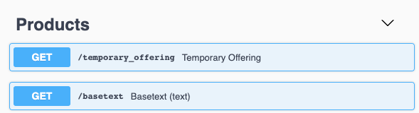
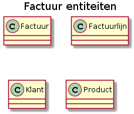
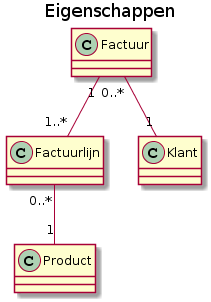
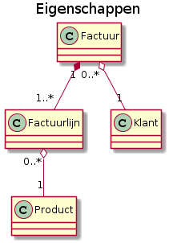
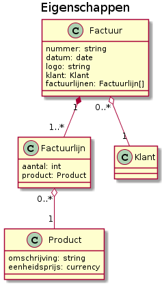
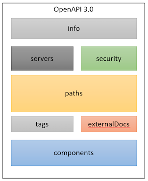

# API Design practices

## Index
<!-- TOC -->

- [API Design practices](#api-design-practices)
    - [Index](#index)
    - [Document historiek](#document-historiek)
- [1. Introductie](#1-introductie)
    - [Enkele definities](#enkele-definities)
    - [Requirements vs Design](#requirements-vs-design)
- [2. Enkele basis begrippen](#2-enkele-basis-begrippen)
    - [Think Resources](#think-resources)
    - [Methods](#methods)
    - [Stateless](#stateless)
    - [Resuest Body, Path en methods](#resuest-body-path-en-methods)
    - [Andere basics](#andere-basics)
- [3. Analyse voorbereiding](#3-analyse-voorbereiding)
    - [Zoek de entiteiten](#zoek-de-entiteiten)
    - [Relaties tussen entiteiten](#relaties-tussen-entiteiten)
    - [Aggregatie en compositie](#aggregatie-en-compositie)
    - [Zoek de eigenschappen van een entiteit](#zoek-de-eigenschappen-van-een-entiteit)
- [4. Design Principes](#4-design-principes)
- [5. Tools](#5-tools)
- [6. API design](#6-api-design)
    - [Structuur van een OAS 3 document](#structuur-van-een-oas-3-document)
    - [YAML](#yaml)
    - [Info](#info)
    - [Servers](#servers)
    - [Security](#security)
    - [Paths](#paths)
        - [URI structuur](#uri-structuur)
    - [Resources](#resources)
        - [Naming conventions](#naming-conventions)
        - [Request query parameters](#request-query-parameters)
        - [Root of sub-collectie](#root-of-sub-collectie)
- [TODO: nog verder uitschrijven](#todo-nog-verder-uitschrijven)

<!-- /TOC -->

## Document historiek

Versie       | Auteur                 | Datum      | Opmerkingen
------       | -------                | -----      | ------------
0.0.1        | Erik Lenaerts          | 09/01/2020 | Initial draft.


# 1. Introductie

In dit document beschrijven we best practices voor het ontwerpen van RESTful API's <sup>[[1]](#footnote-1)</sup> met een JSON payload. Bedoeling is dat iedereen functionele requirements kan omzetten in een RESTful API ontwerp. We noteren dit ontwerp in [Open API Specification v3.0.2](https://swagger.io/specification). 

## Enkele definities
Voor de eenvoud van het lezen van dit document hanteren we volgende afkortingen:
- **API:** als kortere notatie voor "RESTful API met JSON payloads". Ingeval we iets anders bedoelen (e.g. SOAP API), zullen we dat expliciet vermelden 
- **Swagger:** Deze term wordt nog regelmatig gehanteerd voor de taal waarmee we API's uitdrukken. Ondertussen is *"swagger"* omgedoopt tot OAS 2 ofwel [Open API Specififcation 2](https://github.com/OAI/OpenAPI-Specification/blob/master/versions/2.0.md#openapi-specification).
- **Swagger file:** "Kan je een swagger file bezorgen" hoor je nogal eens vaak bij Digipolis. Dit is een bestand in meestal [JSON](http://www.yaml.org/spec/1.2/spec.html#id2803231) of het [YAML](http://yaml.org/spec/1.2/spec.html#id2802346) formaat met hierin het ontwerp van de API volgens de OAS 2 specificatie.
- **OAS:** Ofwel [Open API Specification](https://swagger.io/specification), de opvolger van de swagger notatie. Zonder meer refereren we hier naar v3.

> #### Tip voor terminologie
>
> We stellen voor om vanaf nu de term *"swagger"* niet meer te gebruiken maar eerder *"OAS"*. 

## Requirements vs Design

Digipolis heeft op Github haar [API Requirements](https://github.com/digipolisantwerpdocumentation/api-requirements) gedocumenteerd. Dit zijn een set van regels die we volgen zodat alle API's hetzelfde eruit zien. Het geeft bijvoorbeeld aan [welke parameters moeten gebruikt worden voor paging](https://github.com/digipolisantwerpdocumentation/api-requirements#paginatie-query-parameters) of  welke [HTTP verbs](https://github.com/digipolisantwerpdocumentation/api-requirements#http-verbs-1) we hanteren en hun doel. De API requirements is een document dat vooral is gericht naar ontwikkelaars. 

Het ontwerp van een API, ofwel het "design" ervan beschrijft een set van best practices hoe je een functioneel onderwerp omzet naar een API. Zo wordt er o.a. ingegaan hoe je routes best inricht. 

De meeste ontwikkelaars zijn bezig met de interne kant van een API. We zien vaak dat van daaruit de swagger files worden gegenereerd. Dit resulteert in soms nogal cryptische API's zoals het voorbeeld hieronder. de `GET /basetext` is een niet voor de hand liggende naam. 

<a class="anchor" id="figuur-1"></a>
<p align="center">
  
  <div align="center"><i>figuur 1 - cryptische api</i></div>
</p>

> #### Intuïtieve API's
> *...leggen zichzelf uit door de eenvoud en elegantie van hun ontwerp. Deze API's zijn ontworpen met een outside-in-business perspectief waardoor ze bijdragen aan een fluent [Developer eXperience (DX)](https://hackernoon.com/the-best-practices-for-a-great-developer-experience-dx-9036834382b0).*

# 2. Enkele basis begrippen

> #### >> Fast Forward
> Ken je reeds hoe basis REST API's werken? Ga dan ineens verder naar het [API ontwerp](#api-design) anders, toch nog even nalezen hieronder hoe je een voorbereidende [functionele analyse](#analyse-prep) best aanpakt.

## Think Resources

De basis van API's zijn [Resources](https://github.com/digipolisantwerpdocumentation/api-requirements#rest-introductie). Dit is een abstract concept en is in essentie eender wat je kan benaderen voor een gegeven URL. Denk aan de entiteiten in je functioneel domein zoals, facturen, bestellingen, dossiers, meldingen, users, etc. 

## Methods

Resources kan je opvragen, aanmaken, aanpassen, verwijderen, etc. Bewerkingen uitvoeren op resources doe je via `Methods`. In een REST API ga je deze methods realiseren via `HTTP Verbs`. De meest gebruikte HTTP Verbs zijn `GET`, `POST`, `PUT`, `PATCH` en `DELETE`. Enkele voorbeelden:

``` HTTP
GET /invoices          Haal een lijst van invoices op
GET /invoices/20037    Haal invoice 20037 op
POST /invoices         Voeg een nieuwe invoice resource toe aan de invoices collection
PUT /invoices/20037    Update de data van invoice 20037
PATCH /invoices/20037  Pas enkele gegevens van invoice 20037 aan
DELETE /invoices/20037 Verwijder invoice 20037 van de collection
```

## Stateless

Wanneer afnemers werken met een API's, is elke request onafhankelijk van een vorige of volgende request. De API (aka server) bouwt geen "sessie" of "context" op tussen individuele requesten voor de respectievelijke afnemers (clients).

Stel dat we een factuur creëren door volgende `HTTP POST` Request: 

``` HTTP
POST /invoices HTTP/1.1
Content-Type: application/json
{
    "customerId": "153675ghj7",
    "invoiceDate": "..."
    "..."
}
```

Vervolgens voegen we een factuurlijn toe, merk op dat we hier nergens het factuurnummer meegeven dat we terug gekregen hebben van de vorige request.

``` HTTP
POST /invoices/lines HTTP/1.1
Content-Type: application/json
{
    "productKey": "1TER",
    "quantity": 2
    "..."
}
```

Dit gaat dus __*NIET*__ werken. 

De API gaat voor mij - lees mijn client sessie - niet onthouden welk factuur ik net heb gemaakt. Je moet met andere woorden expliciet alle data meegeven dat nodig is om de volledige call af te handelen. In onderstaand voorbeeld geven we het factuurnummer mee in het path `POST /invoices/20037/lines`. 

``` HTTP
POST /invoices/20037/lines HTTP/1.1
Content-Type: application/json
{
    "productKey": "1TER",
    "quantity": 2
    "..."
}
```

## Resuest Body, Path en methods 

Even het voorbeeld herhalen:


``` HTTP
POST /invoices/20037/lines HTTP/1.1
Content-Type: application/json
{
    "productKey": "1TER",
    "quantity": 2
    "..."
}
```

Bovenstaande lijkt wel wat vreemd, niet? De data van het factuurlijn wordt meegegeven in de body van de HTTP Post Request, terwijl het factuur nummer in het pad staat. Eigenlijk lees je bovenstaand voorbeeld als volgt:

*  **Path:** `/invoices/20037/lines` - er is een collectie van facturen met daarin één factuur met nummer 20037 en voor dat factuur is er een collectie van lines (factuurlijnen)
* **Resource Method:** `POST` - en daarvoor wil ik een extra lijn toevoegen, de inhoud ervan staat in de body van de request.
* **Body**: `{ "productKey": "1TER", "quantity": 2, "..."}`: met deze data maak ik het nieuwe factuurlijn aan.
* **Format**: `Content-Type: application/json`: en het formaat van de data die ik meegeef is JSON

## Andere basics

We stellen voor dat we hier niet teveel meer ingaan op de basis van API's. Bekijk zeker de [Digipolis API requirements](https://github.com/digipolisantwerpdocumentation/api-requirements), hierin beschrijven we uitvoerig de details van de Payload (de body), welke afspraken we maken voor naamgeving, omgang met datum en tijd(zones), structuur van de collections en resources, etc. Zeker de moeite om door te gaan ;).


# 3. Analyse voorbereiding

De vraag is, hoe begin je nu aan een API? Wel, eerst en vooral moet je het functioneel domein omzetten in een ontwerp. 

> #### >> Fast Forward
> Ben je al gewoon om functionele analyses te maken, sla dan dit hoofdstuk over en ga meteen aan de slag met het [ontwerpen van API's](#api-design).

De analyse gaan we doen aan de hand van een voorbeeld. We maken hierbij gebruik van [UML Class diagrams](https://en.wikipedia.org/wiki/Class_diagram) als notatievorm, in c maakt het niet uit wat je hier voor gebruikt, al waren het bierkaartjes ;).

## Zoek de entiteiten

In veel analyse technieken zoals [Database Normalization](https://en.wikipedia.org/wiki/Database_normalization) of [Domain Driven Design](https://en.wikipedia.org/wiki/Domain-driven_design) ga je vanuit een functioneel domein op zoek naar een `entiteit`.

Stel, je komt volgende vraag tegen van een klant: 


> #### Situatie schets
> *Ik wil graag een systeem om verkoop `facturen` mee te kunnen maken. Een factuur bevat een logo, een uniek nummer, is steeds voor één specifieke `klant` op een gegeven factuurdatum en bevat één of meerdere `factuurlijnen`. Als ik 2 verschillende `producten` verkoop aan de klant, staan deze elks apart vermeld in 2 verschillende factuurlijnen. Elke factuurlijn toont de product code, een omschrijving, het aantal dat er van verkocht is, de eenheidsprijs van het product en de totaalprijs (aantal x product prijs). Op het einde van het factuur staat het bedrag exclusief BTW, de BTW toelage de totaalprijs inclusief BTW.* 


In bovenstaande tekst, vinden we volgende entiteiten terug:

<a class="anchor" id="figuur-2"></a>
<p align="center">
  
  <div align="center"><i>figuur 2 - entiteiten</i></div>
</p>


## Relaties tussen entiteiten

Neem de zin *"Een factuur bevat een logo, een uniek nummer, is steeds voor één specifieke `klant` op een gegeven factuurdatum en bevat één of meerdere `factuurlijnen`"*. 

Hieruit zien we dat een factuur een klant en factuurlijnen heeft. Er is met andere woorden een relatie tussen beiden. Daarnaast zien we ook dat er een relatie is tussen een factuurlijn en een product. 

<a class="anchor" id="figuur-3"></a>
<p align="center">
  
  <div align="center"><i>figuur 3 - relaties</i></div>
</p>


Bovenstaand schema lezen we als volgt:
* Een factuur is voor één klant, en die klant kan nul of meerdere facturen hebben
* Een factuur heeft minstens één of meerdere factuurlijnen, en een factuurlijn behoort steeds tot één factuur
* Een factuurlijn is voor één product, en een product kan voorkomen op geen of meerdere factuurlijnen.

nul, één of meerdere noemen we ook wel eens [cardinaliteit](https://en.wikipedia.org/wiki/Cardinality_(data_modeling))

## Aggregatie en compositie

Als we het voorgaande nog verder modeleren, kunnen we volgende stellen:

* Een klant, kan bestaan zonder dat deze ooit een factuur heeft
* Een product kan bestaan in het systeem zonder dat het ooit op een factuur is voorgekomen
* Een factuurlijn daarentegen kan enkel bestaan voor een gegeven factuur. Sterker nog, het heeft zelfs geen enkel bestaansrecht op zichzelf.

Deze zaken drukken we uit via aggregatie en compositie. Maw, 

* **aggregatie:** de entiteit in een relatie heeft een bestaansrecht ook buiten haar relatie
* **compositie:** de entiteit in een relatie heeft geen bestaansrecht buiten haar relatie

Dit wordt weergegeven door open of gesloten ruiten in het diagram
<a class="anchor" id="figuur-4"></a>
<p align="center">
  
  <div align="center"><i>figuur 4 - Aggregatie en Compositie</i></div>
</p>

Later in het ontwerp van de API gaan we zien waarom dit verschil nu net belangrijk is.


## Zoek de eigenschappen van een entiteit

De zin *"Een factuur bevat een `logo`, een `uniek nummer`, is steeds voor één specifieke `klant` op een gegeven `factuurdatum` en bevat één of meerdere factuurlijnen"* beschrijft ook de eigenschappen van een **factuur**. 

* een logo
* (uniek) factuurnummer
* een factuurdatum

Vanuit de oorspronkelijke vraag komen we dan bij het volgende diagram uit:

<a class="anchor" id="figuur-5"></a>
<p align="center">
  
  <div align="center"><i>figuur 5 - eigenschappen</i></div>
</p>

In essentie is dit het soort werk dat we als analist doen. In volgende hoofdstukken gaan we dit analyse ontwerp in detail omzetten in een elegante API's. Maar daarvoor moeten we eerst ons in de juiste mindset krijgen, vandaar de Design Principes

# 4. Design Principes

1. Als ontwerper van een API beschouw je deze API als een eindproduct en niet als een technisch tussenstuk. Wees als een goed ***Product Owner***, net zoals je dat zou doen bij applicaties voor eindgebruikers. 

2. bij het ontwerp, kijk je door de bril van de afnemers ofwel een ***Outside-In perspective***. 

3. Je ***klanten zijn ontwikkelaars/developers***, leer hen kennen, net als klanten voor applicaties. 

4. Maak goede leesbare - niet gegenereerde - ***documentatie*** met voorbeelden, edge cases, mogelijke fouten en oplossingen. *(Hier alvast enkele [tips](https://github.com/digipolisantwerpdocumentation/api-requirements/blob/master/swagger-docs.md))*.

5. Hou het ontwerp ***eenvoudig en intuïtief***, hoe minder externe documentatie er moet gelezen worden hoe beter het ontwerp. 

6. Werk in ***iteraties*** en verbeter de consistentie en eenvoud over de tijd heen op basis van afnemer feedback .

7. ***API Design First:*** Door eerst het ontwerp van de API te maken, voor dat we beginnen met de implementatie ervan, hebben we enkele voordelen:
    * Je kan vroeg in het process feedback verzamelen
    * Je kan iteratief te werk gaan. Bij elke sprint kan je het API ontwerp verfijnen en zo overmaken aan de ontwikkelaars.
    * Ontwikkelaars kunnen aan de hand van het preciese ontwerp meteen zien wat er van hen verwacht wordt.
    * Swagger files kunnen bezorgd worden aan afnemers, nog voor de API implementatie klaar is. Het werkt zo als een contract tussen beide van wat er gaat komen.
    * Tools kunnen helpen met de kwaliteit van je API ontwerp en zo bijdragen aan een betere analyse in het geheel.


Jef Bezos van Amazon zij ooit `if you build it, you run it`, dit gaat hier ook op, toch gedeeltelijk. Na de bouw is er een commerciële en operationele bezigheid. Je brengt de API aan de man en je zorgt ervoor dat deze blijft draaien. Dit laatste laten we weliswaar liever over aan de gespecialiseerde mensen 

# 5. Tools

* https://editor.swagger.io/: een eenvoudige online editor.
* https://swagger.io/tools/swaggerhub/: gaat verder dan de basis editor en laat toe om je werk eveneens te bewaren in de cloud.
* https://www.getpostman.com/: vooral om API's te testen (ook door middel van API mocking)
* https://openapi-validator.antwerpen.be/: controleer de kwaliteit van je API ontwerp, volgens de Digipolis API regels. 

# 6. API design

We gaan met het voorbeeld uit de [Analyse voorbereiding](#analyse-prep) verder. Het class model uit [figuur 5](#figuur-5) gaan we omzetten in een API ontwerp.

## Structuur van een OAS 3 document

Zoals eerder vermeld, gaan API's uitgeschreven worden volgens de [Open API Specification v3.0.2](https://swagger.io/specification). Laten we kort inzoomen op de onderdelen van z'n file:

<a class="anchor" id="figuur-6"></a>
<p align="center">
  
  <div align="center"><i>figuur 6 - OAS 3 Onderdelen</i></div>
</p>

* [info](https://github.com/OAI/OpenAPI-Specification/blob/master/versions/3.0.2.md#infoObject): hier zit de basis info in over de API, waaronder de naam, omschrijving en contact informatie. 
* [servers](https://swagger.io/docs/specification/api-host-and-base-path/): Definities van de plaatsen waar je API staat (dev, acc, prod, etc.) 
* [security](https://swagger.io/docs/specification/authentication/): Beschrijft hoe je je moet authenticeren om deze API te kunnen gebruiken
* [paths](https://swagger.io/docs/specification/paths-and-operations/): Dit is het hart, hier beschrijf je aan de hand van Paths (aka Routes) wat je precies met je API kan doen.
* [components](https://github.com/OAI/OpenAPI-Specification/blob/master/versions/3.0.2.md#components-object): Hierin staan de herbruikbare delen van je API ontwerp zoals schema's, headers, responses, etc.

## YAML

In YAML formaat <sup>[[2]](#footnote-2)</sup> zien deze OAS onderdelen er als volgt uit:

```yaml
openapi: 3.0.0
info:
  ...
servers:
  ...
paths:
  ...
components:
  ...
tags:
  ...
```

> #### YAML 101
> YAML formaat werkt via `key-value` pairs. Je geeft de naam van een key en vervolgens de waarde erachter. 
>
> Key-value pairs die behoren tot een collectie worden samen gevormd doordat ze geïendeerd zijn (lees, door 2 of meerdere spaties vooraan de regel toe te voegen). Zo zie je dat version, title en description behoren tot de info collection.
>
> Tot slot zijn er lijsten, deze kan je herkennen door het `-` teken vooraan elke lijn

Een voorbeeld uit de [analyse](#analyse-prep) hierboven ziet er dan als onderstaande uit. 

```yaml
openapi: 3.0.0
info:
  version: '1.0.1'
  title: 'Sales Invoice API'
  description: 'Create and manage Sales Invoices..'
servers:
  - url: 'https://api-gateway/digipolis/sales-invoice/v1/...'
    description: development
paths:
  '/invoice/{number}':
    get:
      summary: Retrieve a Sales Invoice
      description: Retrieve exactly one `Sales Invoice`...
      parameters:
        - salesinvoicenumber:
            name: number
            in: path
            required: true
            schema:
              type: string
              example: 20037              
      responses:
        '200':
          description: OK
      tags:
        - Invoicing
        - System
```

## Info 

Dit is de header van je API waarin je een goede naam kiest. We stellen voor om steeds zelfstandige naamwoorden te gebruiken en geen werkwoorden zoals

```
- Sales Invoice API
- Users API
- Digital Asset Management API
```

Naast de naam, geef je een versie op volgens de [Semver 2](https://semver.org/) standard. Tijdens het ontwerpen (nog voor het effectief live gaan dus), stellen we voor om te werken met versie `0.x.y`. Vanaf dat je de API effectief gaat publiceren, kan je gebruik maken van  major `1.x.y`.

```yaml
openapi: 3.0.0
info:
  version: '0.0.2'
  title: 'Sales Invoice API'
  description: 'Create and manage Sales Invoices.....'
```

## Servers

> todo

## Security

> todo: https://swagger.io/docs/specification/authentication/

## Paths

Dit is de crux van je API, hier zal het meest van je ontwerp werk in tevoorschijn komen. Even een herhaling van in de [API requirements](https://github.com/digipolisantwerpdocumentation/api-requirements)

### URI structuur

Resources dienen steeds te worden benaderd volgens onderstaande URI structuur
``` HTTP
https://{hostname}/{namespace}/{vx}/{resource-URI}
```

API URI's dienen steeds te worden geversioneerd (**/vx**). Aangezien wordt gekozen voor het root namespace versioneringsmodel, dient de major versie steeds te worden opgenomen in de URI en dit achter de namespace.  
De **namespace** is een enkelvoudig zelfstandig naamwoord dat het onderwerp van de API omschrijft, gezien vanuit het standpunt van de API consumer. Dit is best in overeenstemming met de naam van de API dat je opgeeft in het `info.title` element van de swagger.

Dit resulteert in onderstaand totaal voorbeeld :
``` HTTP
https://api-gateway/digipolis/sales-invoice/v1/...
```

## Resources

Data dat we opsturen of ontvangen wordt een `Resource` genoemd. 

> *The key abstraction of information in REST is a resource. Any information that can be named can be a resource: a document or image, a temporal service (e.g. “today’s weather in Los Angeles”), a collection of other resources, a non-virtual object (e.g., a person), and so on. In other words, any concept that might be the target of an author’s hypertext reference must fit within the definition of a resource. A resource is a conceptual mapping to a set of entities, not the entity that corresponds to the mapping at any particular point in time.* 
>
> [Roy Fielding’s dissertation](https://www.ics.uci.edu/~fielding/pubs/dissertation/rest_arch_style.htm#sec_5_2_1_1)

Een Resource naam is enkelvoudig bijvoorbeeld `customer` en meerdere Resources samen is een **collection** en is in het meervoud `customers`

``` HTTP
GET /customers      (haal de klanten collectie op)
GET /customers/123  (haal klant met ID 123 op uit de collectie)
```

Soms heeft een resource ook een **sub-collecion**, deze worden dan onderdeel van een hierarchie zoals dit bijvoorbeeld:
``` HTTP
GET /invoices/20201/invoicelines
``` 
### Naming conventions

-   Resources worden steeds in het meervoud gedefinieerd (uitzondering : controllers, status resource)
``` HTTP
GET /partners
```

-   Gebruik steeds lowercase voor URI en query parameters. Dit vermijdt technologie afhankelijke problemen met casing.
``` HTTP
GET /partners?page=10&pagesize=20
```

-   Gebruik geen underscores "\_" of dots "." in de URI. Gebruik hyphenation om woorden van elkaar te scheiden. Dit verhoogt de
    leesbaarheid van de URI.
``` HTTP
GET /business-parties?page=10&pagesize=20
```

-   Gebruik geen trailing slash in de URI. Een trailing slash heeft geen toegevoegde waarde en verlaagt bovendien de leesbaarheid van de URI.
``` HTTP
GET /partners/
gebruik je dus NIET
```

-   Gebruik geen fragments (\#) in de URI. Fragments worden gebruikt om te navigeren binnen een web context pagina, maar mogen niet gebruikt worden in een API URI.
``` HTTP
GET /partners#name/
gebruik je dus NIET
```

### Request query parameters

Query parameters worden steeds gebruikt om bepaalde functionaliteiten zoals paginatie, filtering, sortering, etc aan te spreken. Ze worden NIET gebruikt om resource representaties mee te geven.

Onderstaan voorbeeld is niet enkel onleesbaar, het laat ook niet toe om hiërarchieën op een eenvoudige manier op te nemen in de representatie.

``` HTTP
POST /business-parties?company=Google&website=http://www.google.com/&addressLine1=111 8th Ave&addressLine2=4th Floor&state=NY&city=New York&zip=10011

gebruik je dus NIET
```

### Root of sub-collectie

Wanneer kies je nu voor een collection of een sub-collection? Herinner je het [Aggregatie en compositie](#aggregatie-en-compositie) verhaal in de analyse voorbereiding?

**Aggregatie:** je maakt een collectie aan op de root
``` HTTP
GET /invoices 
``` 
**Compositie:** je maakt een sub-collectie aan
``` HTTP
GET /invoices/20201/invoicelines
``` 
*Reminder: aggregaties zijn entititeiten die kunnen leven op zichzelf, composities zijn er die enkel een bestaansrecht hebben onder een ander.*
 
# TODO: nog verder uitschrijven

Werk het voorbeeld van de analyse stap hierboven helemaal uit zodat er hiervoor een OAS 3 document bestaat.

---
1. <a class="anchor" id="footnote-1"></a>We gebruiken de term RESTful API ook al zijn we hier niet 100% compatible met [level 3 van het Richardson Maturity Model](https://martinfowler.com/articles/richardsonMaturityModel.htm). Onze API Requirements zorgen wel dat er de HAL standard wordt gevolgd voor het [Paged Responses](https://github.com/digipolisantwerpdocumentation/api-requirements#paginatie-response-bericht)   
2. <a class="anchor" id="footnote-2"></a>We geven de voorkeur aan, om onze voorbeelden in [YAML formaat](https://en.wikipedia.org/wiki/YAML) te documenteren omdat deze aangenamer zijn om te lezen in plaats van [JSON](https://en.wikipedia.org/wiki/JSON). In de praktijk mogen beide vormen gebruikt worden uiteraard.


